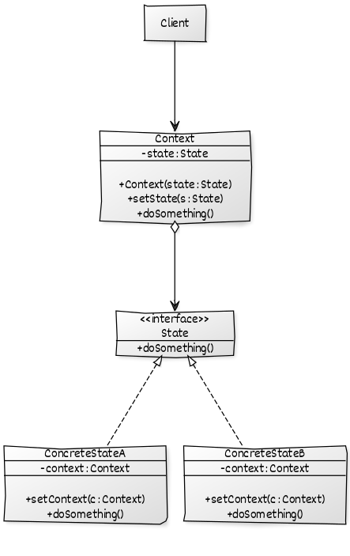

## A small ATM Console Application with State Design Pattern

This is a very small ATM console application, and it simulates an ATM that we often use in our daily lives.

Imagine you go out and need to withdraw some cash, so you find an ATM and put your card in and enter you PIN.

If your PIN is valid you are directed to a menu which displays some functionalities.

You make your choice and just follow the instructions.

## Does this simulation solve a problem ?

Yes, of course. When we think what kind of issues we confronted while using these machines, I guess we all will remember a time that ATM is out of cash.

So, we may foresee that the ATM will alter its behaviour for further operations and you will have to look for an another ATM to withdraw money.

An ATM should change its behavior when its internal state changes. State-specific behavior should be defined independently. That is, adding new states should not affect the behavior of existing states.

The State type itself actually provides an interface for encapsulating the behaviors associated with a particular state of the Context type. This interface representation can be evaluated by actual state types (Concrete State). In line with these definitions, the UML diagram of this design pattern will be as follows.

## State:
It is the interface where the behavior/event is defined, it can also be an abstract class.

## ConcreteState:
Implements the State interface, so different states occur.

## Context: 
The object whose status will be monitored.

## In this ATM simulation the states are :

##### 1. InitialState

    - ATM waits for you to insert a card or enter a card number

##### 2. CardNumberEnteredState
    
    - When you inserted your card into ATM, a welcome message will be displayed and will want you to type you PIN.   

##### 3. LoggingInState
    
    - After typing your PIN; ATM will make some validation with help of Server

##### 4. LoggedInState
    
    - If your PIN is valid, you will be able to access all the available functionalities of ATM    

##### 5. DisplayTheCommandsState
 
> All the commands after the validation will be as follows :

    1. ViewBalanceState
    2. WithDrawState
    3. DepositState
    4. LogOutState
    5. ChangePinState

##### 6. ErrorState
    
    - If any error occurs during the operations, you will be informed by this state

## How to use ?

 `- Please be sure that the atm-server is up and running with a mongodb instance`

 `- It is presumed Mongo runs on port 27017 and server app on port 8080.`

 `- If you have authentication on your DB, please edit the application.yaml under the resources folder of atm-server app`

 `- atm-server app will crete a test record and its properties will be persisted always`

 `- If you change the server host and port in server app please do not forget to alter the values on config/AppSettings in the client app`

> **Please use <1> for credit card number and <1234> for PIN for testing purpose**

